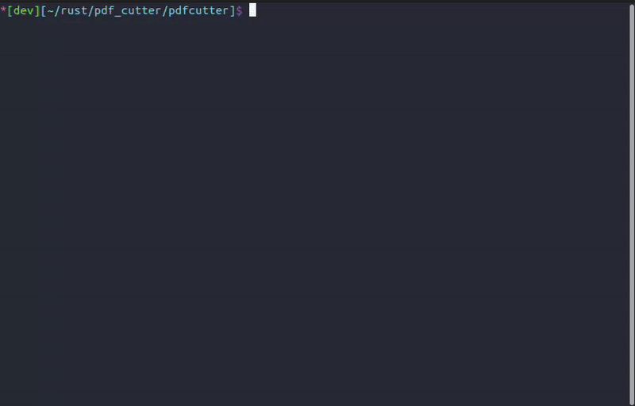

# PDF Cutter

A command-line tool for manipulating PDF files, including merging and deleting pages. Built with Rust for performance and safety.

--- 
## Features

- **Merge PDFs**: Combine multiple PDF files into one
- **Delete Pages**: Remove specific pages from a PDF file
- **Split Pages**: Divide a PDF file into multiple segments
- **Interactive TUI**: User-friendly terminal interface
- **Command Line**: Scriptable CLI interface
- **Privacy-First**: Process files locally, no cloud upload required
---

## Installation and Usage

For detailed installation instructions, please refer to the [Installation Guide](docs/install.md).
To get started with the command-line interface, check out the [CLI Usage Documentation](docs/usage-cli.md).
For using the Terminal User Interface (TUI), see the [TUI Usage Documentation](docs/usage-tui.md).

---

## Built With

- **[lopdf](https://crates.io/crates/lopdf)**: Low-level PDF manipulation
- **[clap](https://crates.io/crates/clap)**: Command-line argument parsing
- **[ratatui](https://crates.io/crates/ratatui)**: Terminal user interface

---
## Motivation

This project was created to provide a simple and efficient way to manipulate PDF files from the command line. I wanted to stop using online tools for simple tasks like merging or deleting pages from PDFs. With this tool, users can easily manage their PDF documents without relying on third-party services and keep their files private.

---
## Development Status

**Status**: In active development

## 📝 License

This project is open source. See the repository for license details.

## Contributing

Contributions are welcome! Please feel free to submit issues and pull requests.